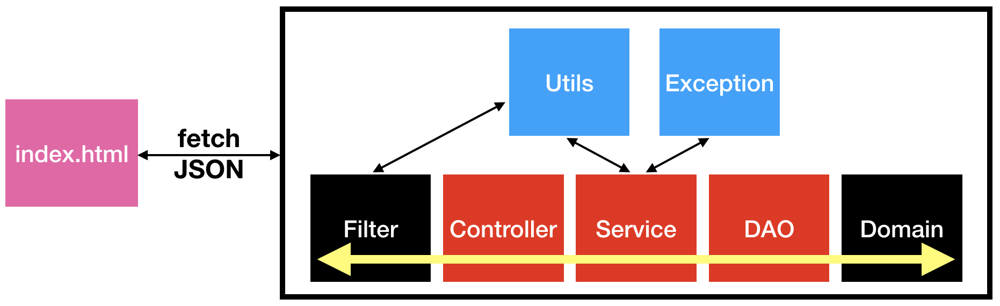
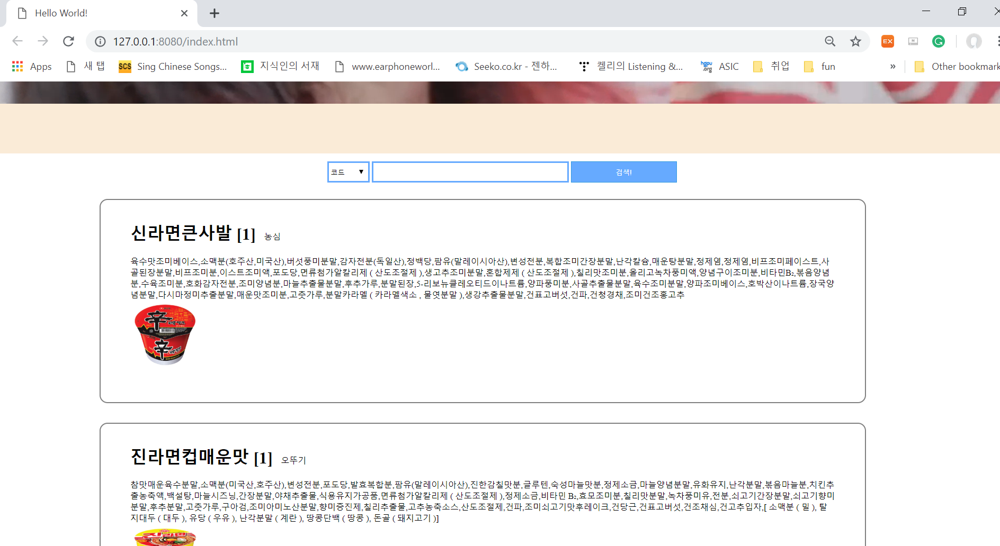
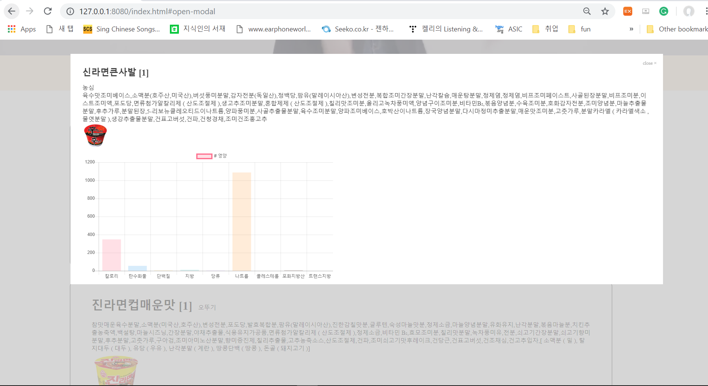
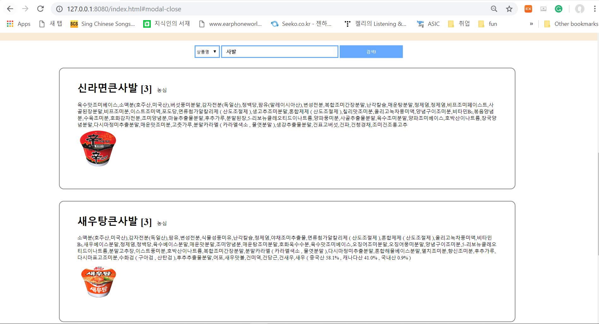
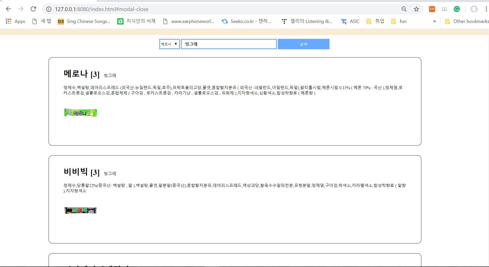
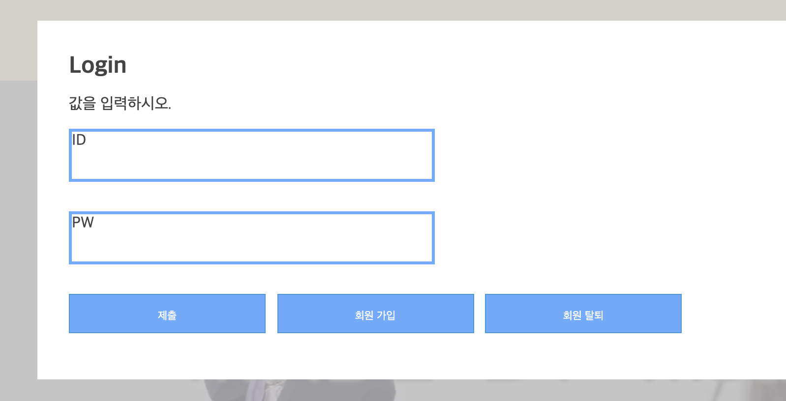
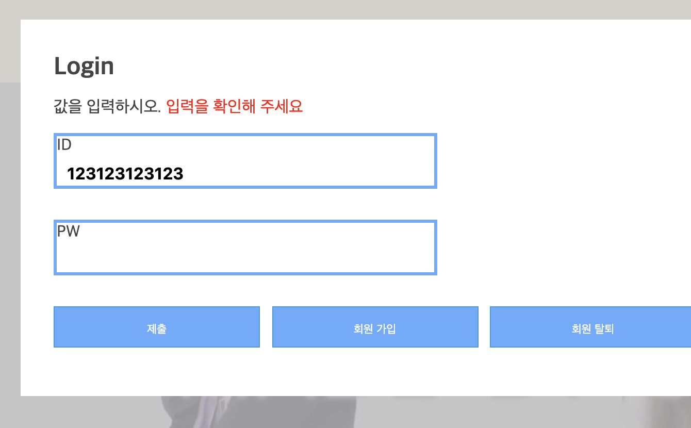
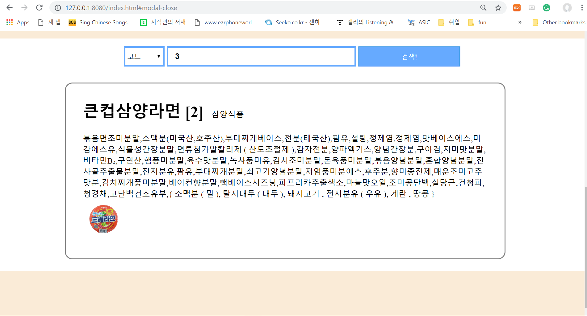
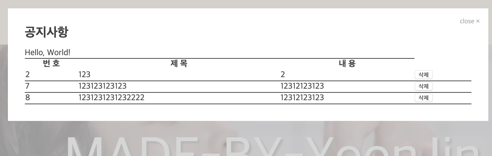

SAFE FOOD
---

- 이상철, 박윤진

특이사항: Front-end 와 Back-end 를 완전히 분리, Front 의 경우 SPA 로 구성. 바닐라 JS

주요 기능들

1. 클래스 다이어그램 with UseCase

    

   - front 가 완전히 분리되어 있으며 라이브러리를 의존하지 않아 `fetch` 로 `JSON` 통신.
   - 모든 Path 에 filter 를 통해 `UTF-8`, `CORS` 처리 : FRONT - BACK 이 다르므로 `Origin` 이슈가 있다.
   - 모든 요청은 `Controller` 가 분기하며 `Service` 가 모든 로직을 처리한다.
   - `DAO` 는 요청에 따라 데이터를 관리하는 주체.

2. 기본(필수) 기능

    - 메인 페이지, 식품 정보 목록 및 상세, 회원정보, 로그인/로그아웃 구현

    
    
    
    
    
    
    
    
    
3. 추가 기능

    - `hit` 변수를 두어 검색마다 값들을 참조, 제목에 표시

    

4. 심화 기능

    - 공지사항 CRUD 구현.

    

5. 기타

    - 각종 CSS

    

Copyright 2019. SSAFY-Seoul-4. All rights reserved.
